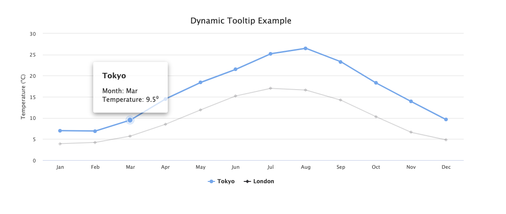

# Angular Highcharts Tooltip

## Problem with Angular Highcharts and tooltips

Original motivation for this project: https://www.highcharts.com/forum/viewtopic.php?t=34906

Using Highcharts with Angular comes with a few tradeoffs. The most difficult one that I have come across has been the lack of dynamic component support in the highcharts tooltip formatter. This repository shows you how to easily create a dynamic tooltip component with real chart data and inject it into the Highcharts view.
[Live example](https://angular-highcharts-tooltip.netlify.app/).



## Setting up a dynamic tooltip

After creating your custom tooltip component, you can use the `ComponentFactory` class example to return a dynamically injected component. This symbol can then be passed through to the Highcharts formatter callback by using your new components `nativeElement.outerHTML` property. This allows you to fully control the template and styling of your tooltip instead of defining it using the Highcharts tooltip formatter API and string interpolation. You can also bind the point data that is currently hovered over, and pass that to a data attribute on your custom tooltip component.

[Implementation example](https://github.com/areknow/angular-highcharts-tooltip/blob/master/src/app/chart/chart.component.ts#L58).

[Custom tooltip example](https://github.com/areknow/angular-highcharts-tooltip/blob/master/src/app/tooltip/tooltip.component.html).

## Starting the demo

Run the following commands after cloning this repository to demo this on your local machine

```
$ npm install
$ ng serve
```
